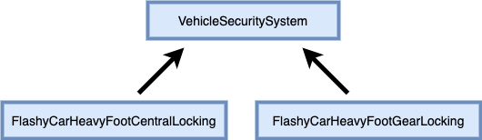
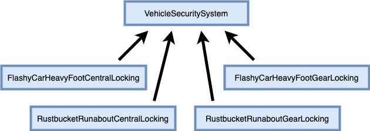

# Java Coding Challenge
## Piranha Security

Piranha Security creates car alarm systems to prevent theft. They have a range of products, including air bgs, GPS, reverse parking, and so forth. A software system is required tot rack their orders, e.g. which product to fit into each car.

They recently received an order from Flashy Cars, who want a central and gear locking system for their new Heavy Foot racer spec. Therefore, the developers made the abstract class VehicleSecuritySystem, and put there some car specific methods and features which they deemed common to all security products. They extened the class, creating two different sub classes and named them FlashyCarHeavyFootCentralLocking, and FlashyCarHeavyFootGearLocking. The resultant system resembles this class diagram:



However, then another company, Rustbucket, requested a different type of central and gear locking system for their Runabout spec. The two specs of car have different security systems. Therefore, the Piranha dev team had added two new classes RustbucketRunaboutCentralLocking, and RustbucketRunaboutGearLocking which also extend the VehicleSecuritySystem class.

Currently, the class diagram is as follows:



Think about this. What about when they receive an order for a new system? What if there are eventually 20 systems? Is the current approach appropriate?

### Requirements
1. Explain the issues/problems that could arise regarding future new features.
2. Explain which coding standards/principles this violates.
3. Demonstrate, with the use of a Gang of Four design pattern, a more appropriate solution. (Complete the attached code.)
4. Justify the choice of pattern.
5. Implement unit testing - 80% coverage, and small methods.
6. Fix any bugs.

### Require Test Output
```
Creating Central Locking 
Preparing alarm system Central Locking as per FlashyCar HeavyFoot spec
Assembling Central Locking for FlashyCar HeavyFoot spec
Vehicle: FlashyCar HeavyFoot spec, Alarm System: Central Locking

Creating Gear Locking
Preparing alarm system Gear Locking as per FlashyCar HeavyFoot spec
Assembling Gear Locking for FlashyCar HeavyFoot spec
Vehicle: FlashyCar HeavyFoot spec, Alarm System: Gear Locking
------------------------------------------------------
Creating Central Locking 
Preparing alarm system Central Locking as per Rustbucket Runabout spec
Assembling Central Locking for Rustbucket Runabout spec
Vehicle: Rustbucket Runabout spec, Alarm System: Central Locking

Creating Gear Locking
Preparing alarm system Gear Locking as per Rustbucket Runabout spec
Assembling Gear Locking for Rustbucket Runabout spec
Vehicle: Rustbucket Runabout spec, Alarm System: Gear Locking
```
